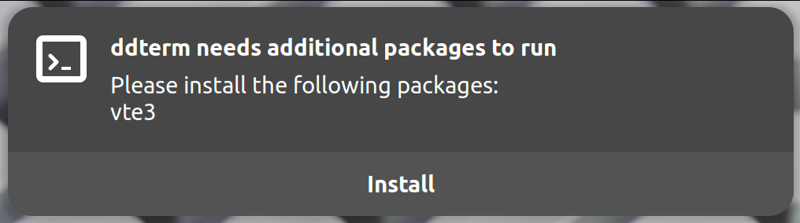

<!--
SPDX-FileCopyrightText: 2026 Aleksandr Mezin <mezin.alexander@gmail.com>

SPDX-License-Identifier: MIT
-->

# gjs-typelib-installer

[ddterm] depends on multiple GObject libraries (`gi://` imports),
some of them are often not installed by default.

Instead of silently failing, a notification is shown:

On supported distributions, it has an "Install" button, which installs
the requested packages.

gjs-typelib-installer is the backend for it. It implements:

1. [`require()`] function that tries to import libraries, and throws
[`MissingDependencies`] exception if import fails. The exception contains
a list of packages that need to be installed to fix the issue.

2. [`findTerminalInstallCommand()`] function that finds a working package
installation method for the current OS.

[ddterm]: https://github.com/ddterm/gnome-shell-extension-ddterm
[`require()`]: https://ddterm.github.io/gjs-typelib-installer/functions/require.html
[`MissingDependencies`]: https://ddterm.github.io/gjs-typelib-installer/classes/MissingDependencies.html
[`findTerminalInstallCommand()`]: https://ddterm.github.io/gjs-typelib-installer/functions/findTerminalInstallCommand.html
